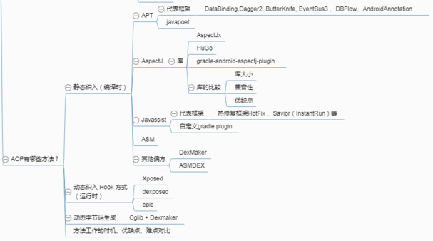

# AOP

https://blog.csdn.net/u010289802?t=1

https://blog.csdn.net/u010289802/article/details/80183142

https://juejin.cn/user/4318537403878167/posts

#### 1.AOP是什么

AOP:  即面向切面编程。 和OOP一样，是一种程序设计思想.实现是通过预编译方式和运行期动态代理实现程序功能的统一维护。

OOP（Object Oriented Programming）面向对象设计就是一种典型的纵向编程方式。
OOP更多关注的是对象Object本身的功能，对象之间的功能的联系往往不会考虑的那么详细。

1、继承模式比如之类和父类之间的这种关系就是一个很好的展示。

2、分层架构如MVP，每一层之间也是纵向关联在一起的。

切面，也叫横向，横切关注点是一个抽象的概念，它是指那些在项目中贯穿多个模块的业务。AOP在将横切关注点与业务主体进行分类，从而提高程序代码的模块化程度,则是将涉及到众多模块的某一类功能进行统一管理。

1 我们要为方法添加调用日志，那就必须为所有类的所有方法添加日志调用，尽管它们都是相同的。

#### 2.AOP的好处
使用切面的好处：

1.核心代码中不在包含记录日志的代码， 类更专注于它的职责。
2.如果想修改日志的记录方式， 不需要修改Account类，只需要修改相应的配置文件和日志的实现，修改工作量小。
3.解耦。为什么说解耦呢？用打印Log举例，app中可能存在不同的Log框架来实现。如果同一使用Log标签切入，那么在处理Log标签的地方可以统一Log框架。实现AOP的同时需要依赖注入， 这又会减少模块间的依赖。

#### 3.AOP的实现方式

https://juejin.cn/post/6844903741808705544#heading-0

 

https://juejin.cn/post/6844903728525361165#heading-30

Android中AOP的实现方式分两类：

运行时切入

(android hook机制)

集成Dexposed， epic框架（运行时hook某些关键方法）

Java API实现动态代理机制（基于反射，性能不佳）

编译时切入

生成代理类(APT)

集成AspactJ框架(特殊的插件或编译器来生成特殊的class文件)

使用ASM,Javassit等字节码工具类来修改字节码(编译打包APK文件前修改class文件)

1.APT

 APT （Annotation Processing Tool ）即注解处理器，是一种处理注解的工具， 在编译时扫描和处理注解。注解处理器 在编译期，通过注解生成 .java 文件。使用的 Annotation 类型是 SOURCE。

 它在编译时扫描、解析、处理注解。它会对源代码文件进行检测，找出用户自定义的注解，根据注解、注解处理器和相应的apt工具自动生成代码。这段代码是根据用户编写的注解处理逻辑去生成的。最终将生成的新的源文件与原来的源文件共同编译（注意：APT并不能对源文件进行修改操作，只能生成新的文件，例如往原来的类中添加方法）

 代表框架：DataBinding、Dagger2、ButterKnife、EventBus3、DBFlow、AndroidAnnotation

为什么这些框架注解实现 AOP 要使用 APT？

目前 Android 注解解析框架主要有两种实现方法，

一种是运行期通过反射去解析当前类，注入相应要运行的方法。

另一种是在编译期生成类的代理类，在运行期直接调用代理类的代理方法，APT 指的是后者。

如果不使用APT基于注解动态生成 java 代码，那么就需要在运行时使用反射或者动态代理，比如大名鼎鼎的 butterknife 之前就是在运行时反射处理注解，为我们实例化控件并添加事件，然而这种方法很大的一个缺点就是用了反射，导致 app 性能下降。所以后面 butterknife 改为 apt 的方式，可以留意到，butterknife 会在编译期间生成一个 XXX_ViewBinding.java。虽然 APT 增加了代码量，但是不再需要用反射，也就无损性能。

2.AspectJ

（AspectJ）是编译期插入字节码，所以对性能也没什么影响。

通过Gradle Transform API，在class文件生成后至dex文件生成前，遍历并匹配所有符合AspectJ文件中声明的切点，然后将Aspect的代码织入到目标.class。织入代码后的新.class会加入多个JoinPoint,这个JoinPoint会建立目标.class与Aspect代码的连接，比如获得执行的对象、方法、参数等。

整个过程发生在编译期，是一种静态织入方式，所以会增加一定的编译时长，但几乎不会影响程序的运行时效率。

AspectJ 就是一个代码生成工具；
编写一段通用的代码，然后根据 AspectJ 语法定义一套代码生成规则，AspectJ 就会帮你把这段代码插入到对应的位置去。

AspectJ 语法就是用来定义代码生成规则的语法。
扩展编译器，引入特定的语法来创建 Advise，从而在编译期间就织入了Advise 的代码。
如果使用过 Java Compiler Compiler (JavaCC)，你会发现两者的代码生成规则的理念惊人相似。JavaC

3.ASM

ASM提供的API完全是面向Java字节码编程

ASM 是一个 Java 字节码层面的代码分析及修改工具，它有一套非常易用的 API，通过它可以实现对现有 class 文件的操纵，从而实现动态生成类，或者基于现有的类进行功能扩展。

 Android 的编译过程中，首先会将 java 文件编译为 class 文件，之后会将编译后的 class 文件打包为 dex 文件，我们可以利用 class 被打包为 dex 前的间隙，插入 ASM 相关的逻辑对 class 文件进 ASM 是一个 Java 字节码层面的代码分析及修改工具，它有一套非常易用的 API，通过它可以实现对现有 class 文件的操纵，从而实现动态生成类，或者基于现有的类进行功能扩展。

 Android 的编译过程中，首先会将 java 文件编译为 class 文件，之后会将编译后的 class 文件打包为 dex 文件，我们可以利用 class 被打包为 dex 前的间隙，插入 ASM 相关的逻辑对 class 文件进行操纵
行操纵

4.epic

ART中的函数的调用约定,去修改函数的内容，将函数的前两条指令修改为跳转到自己自定义的逻辑，从而实现对任意方法的 Hook。

5.hook

https://zhuanlan.zhihu.com/p/109157321

反射/动态代理
如图中A点，作用于Java层。反射/动态代理是虚拟机提供的标准编程接口，可靠性较高。反射API可以帮助我们们访问到private属性并修改，动态代理可以直接从Interface中动态的构造出代理对象，并去监控这个对象。

常见的用法是，用动态代理构造出一个代理对象，然后用反射API去替换进程中的对象，从而达到hook的目的。如：对Java Framework API的修改常用这种方法，修改ActivityThread、修当前进程的系统调用等。

缺点：只在java层，只能通过替换对象达到目的，适用范围较小

优点：稳定性好，调用反射和动态代理并不存在适配问题，技术门槛低

JNI Hook
如图中B点，java代码和native之间的调用是通过JNI接口调用的，所有JNI接口的函数指针都会被保存在虚拟机的一张表中。所以，java和native之间调用可以通过修改函数指针达到。

优点：稳定性高

缺点：只能hook Java和Native之间的native接口函数

ClassLoader
如图中C点，java代码的执行都是靠虚拟机的类加载器ClassLoader去加载，ClassLoader默认的双亲委派机制保证了ClassLoader总是从父类优先去加载java class。所以一类hook方案就是通过修改ClassLoader加载java class的Path路径达到目的。常见的应用场景有一些热修复技术。

优点：稳定性高

缺点：需要提前编译好修改后的class去替换，灵活性降低了

Xposed相关
如图中D点，这类hook技术的原理都是去修改ART/Dalvik虚拟机，虚拟机为java提供运行时环境，所有的java method都保存在虚拟机一张Map维护，每个Java Method都有个是否是JNI函数的标志位，如果是JNI函数则去查找对应的native函数。所以，一个hook方案是通过把要hook的函数修改为JNI函数，然后实现一个对应的native函数从而达到hook。

大量的一些自动化测试、动态调试都采用这个方法

优点：java层所有的class都可以修改，Activity等都可以注入。灵活性极高。

缺点：ART/Dalvik每次Android系统发布大版本都会被大改，导致每个Android版本都要去适配配。稳定性变差。

前面hook技术都是去修改虚拟机中的java层，如果一个应用还包含Native code话，则得使用不同hook技术

