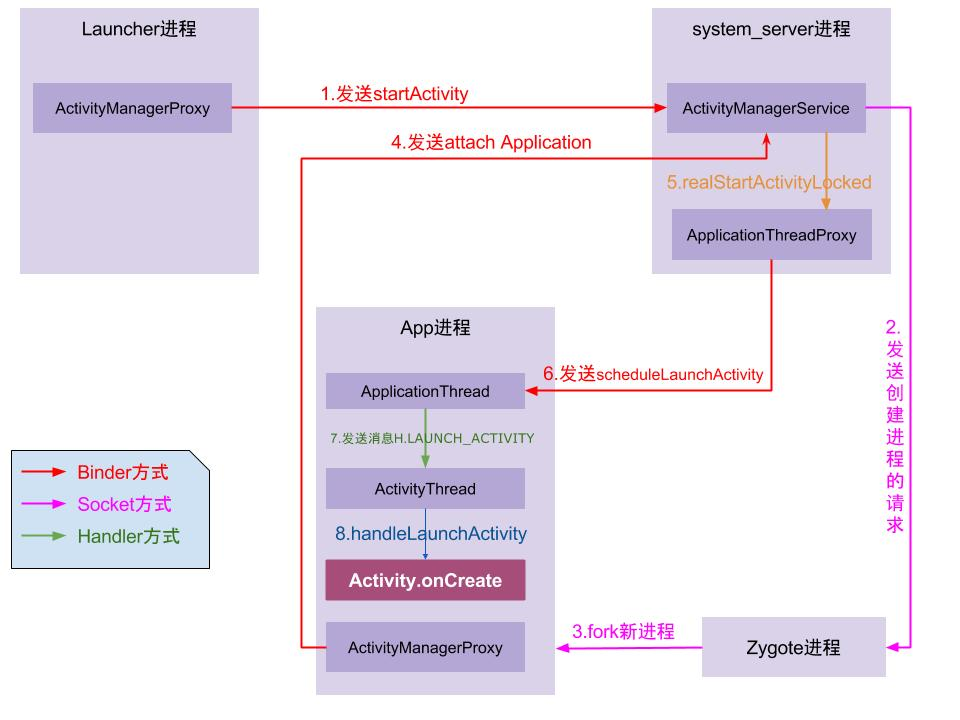

# Activity

## Activity的启动流程

### Activity跨进程启动

[面试必备：Android（9.0）Activity启动流程(一)](https://juejin.im/post/6844903959581163528#heading-1)

[startActivity启动过程分析](http://gityuan.com/2016/03/12/start-activity/)

**启动流程：**

1. 点击桌面App图标，Launcher进程采用Binder IPC向system_server进程发起startActivity请求；

2. system_server进程接收到请求后，向zygote进程发送创建进程的请求；

3. Zygote进程fork出新的子进程，即App进程；

4. App进程，通过Binder IPC向sytem_server进程发起attachApplication请求；

5. system_server进程在收到请求后，进行一系列准备工作后，再通过binder IPC向App进
    程发送scheduleLaunchActivity请求；

6. App进程的binder线程（ApplicationThread）在收到请求后，通过handler向主线程发送LAUNCH_ACTIVITY消息；

7. 主线程在收到Message后，通过发射机制创建目标Activity，并回调Activity.onCreate()等方法。

### Activity进程内启动

1. 请求进程A：startActivity—(hook插入点1)(AMP，ActivityManager代理对象)——>system_server进程：AMS(ActivityManagerService)

2. 解析Activity信息、处理启动参数、scheduleLaunchActivity/mH中EXECUTE_TRANSACTION消息处理(Android P)-->回到请求进程A：ApplicationThread --> ActivityThread -(hook插入点2)-> Activity生命周期

## Activity的启动模式和使用场景

* **android任务栈**

  我们每次打开一个新的Activity或者退出当前Activity都会在一个称为任务栈的结构中添加或者减少一个Activity组件，一个任务栈包含了一个activity的集合。

   android通过ActivityRecord、TaskRecord、ActivityStack，ActivityStackSupervisor，ProcessRecord有序地管理每个activity。

* **Standard**
    默认模式，每次启动Activity都会创建一个新的Activity实例。

* **SingleTop**
    通知消息打开的页面

    如果要启动的Activity已经在栈顶，则不会重新创建Activity，只会调用该该Activity的onNewIntent()方法。

    如果要启动的Activity不在栈顶，则会重新创建该Activity的实例。

* **SingleTask**
    主界面

    如果要启动的Activity已经存在于它想要归属的栈中，那么不会创建该Activity实例，将栈中位于该Activity上的所有的Activity出栈，同时该Activity的onNewIntent()方法会被调用。

* **SingleInstance**
    呼叫来电界面

    要创建在一个新栈，然后创建该Activity实例并压入新栈中，新栈中只会存在这一个Activity实例。

## Activity生命周期

### 执行顺序

* **在A跳转B会执行：** A onPause ->  B onCreate -> B onStart -> B onResume->A onStop

* **在A跳转B会执行：** A onPause ->  B onCreate -> B onStart -> B onResume->A onStop

* **在B按下返回键会执行：** B onPause -> A onRestart -> A onStart -> A onResume-> B onStop -> B onDestroy

* **在A跳转B会执行：** A onPause -> B onCreate -> B onStart -> B onResume->A onStop
* **当 B Activity 的 launchMode 为 singleInstance，singleTask 且对应的 B Activity 有可复用的实例时，生命周期回调是这样的:** A.onPause -> B.onNewIntent -> B.onRestart -> B.onStart -> B.onResume -> A.onStop -> ( 如果 A 被移出栈的话还有一个 A.onDestory)

* **在A跳转B会执行：** A onPause ->  B onCreate -> B onStart -> B onResume->A onStop
* **当 B Activity 的 launchMode 为 singleTop且 B Activity 已经在栈顶时（一些特殊情况如通知栏点击、连点），此时只有 B 页面自己有生命周期变化:** B.onPause -> B.onNewIntent -> B.onResume

* **HOME键的执行顺序：** onPause->onStop->onRestart->onStart->onResume

* **BACK键的顺序：** onPause->onStop->onDestroy->onCreate->onStart->onResume

* **锁屏：** 锁屏时只会调用onPause()，而不会调用onStop方法，开屏后则调用onResume()

* **弹出 Dialog：** 直接是通过 WindowManager.addView 显示的（没有经过 AMS），所以不会对生命周期有任何影响。

* **启动theme为DialogActivity, 跳转透明Activity :** A.onPause -> B.onCrete -> B.onStart -> B.onResume（Activity 不会回调 onStop，因为只有在 Activity 切到后台不可见才会回调 onStop）
* **[横竖屏切换](https://www.jianshu.com/p/dbc7e81aead2) 从 Android 3.2 (API级别 13)开始**
    1. 不设置Activity的androidconfigChanges，或设置Activity的androidconfigChanges="orientation"，或设置Activity的android:configChanges="orientation|keyboardHidden"，切屏会重新调用各个生命周期，切横屏时会执行一次，切竖屏时会执行一次。
        - 竖屏启动：onCreat->onStart->onResume
        - 切换横屏时：onPause-> onSaveInstanceState ->onStop->onDestory ----- onCreat->onStart->onSaveInstanceState->onResume

    2. 配置 android:configChanges="orientation|keyboardHidden|screenSize"，才不会销毁 activity，且只调用 onConfigurationChanged方法。

### onStart 和 onResume、onPause 和 onStop 的区别

* onStart 和 onResume从Activity可见可交互区分
* onStart用户可以看到部分activity但不能与它交互
* onResume()可以获得activity的焦点能够与用户交互
* onStop和onPause从 Activity是否位于前台，是否有焦点区分
* onPause表示当前页面失去焦点。
* onStop表示当前页面不可见。
* dialog的主题页面，这个时候，打开着一个页面，就只会执行- onPause，而不会执行onStop。

### Activity的onNewIntent()方法什么时候执行

* 如果IntentActivity处于任务栈的顶端，也就是说之前打开过的Activity，现在处于onPause、onStop 状态的话，其他应用再发送Intent的话，执行顺序为：onNewIntent，onRestart，onStart，onResume。

* 当ActivityA的LaunchMode为SingleTop时，如果ActivityA在栈顶, 且现在要再启动ActivityA，这时会调用onNewIntent()方法; 

* 当ActivityA的LaunchMode为SingleInstance, SingleTask时, 如果已经ActivityA已经在堆栈中，那么此时再次启动会调用onNewIntent()方法; 

## onSaveInstanceState 和 onRestoreInstanceState

### 调用时机

* **onSaveInstanceState(Bundle outState)会在以下情况被调用：**

    1. 从最近应用中选择运行其他的程序时。

    2. 当用户按下HOME键时。

    3. 屏幕方向切换时(无论竖屏切横屏还是横屏切竖屏都会调用)。

    4. 按下电源按键（关闭屏幕显示）时。

    5. 从当前activity启动一个新的activity时:
        android 28之前: onPause -> onSaveInstanceState -> onStop

        android 28之后: onPause -> onStop-> onSaveInstanceState

 

* **onRestoreInstanceState(Bundle outState)会在以下情况被调用：**
    onRestoreInstanceState(Bundle savedInstanceState)只有在activity确实是被系统回收，重新创建activity的情况下才会被调用。

    1. 屏幕方向切换时，activity生命周期如下
        onPause -> onSaveInstanceState -> onStop -> onDestroy -> onCreate -> onStart -> onRestoreInstanceState -> onResume

    2. 在后台被回收

    3. 按HOME键返回桌面,又马上点击应用图标回到原来页面时不会被回收
        onStart -> onRestoreInstanceState -> onResume

### 源码

 1. 系统会调用ActivityThread的performStopActivity方法中掉用onSaveInstanceState，将状态保存在mActivities中，mActivities维护了一个Activity的信息表，当Activity重启时候，会从mActivities中查询到对应的ActivityClientRecord。
 2. 如果有信息，则调用Activity的onResoreInstanceState方法，在ActivityThread的performLaunchActivity方法中，统会判断ActivityClientRecord对象的state是否为空, 不为空则通过Activity的onSaveInstanceState获取其UI状态信息，通过这些信息传递给Activity的onCreate方法

 ### onCreate和onRestoreInstance方法中恢复数据时的区别

* onSaveInstanceState 不一定会被调用，因为它只有在上次activity被回收了才会调用。所以onCreate()里的Bundle参数可能为空，一定要做非空判断。
* onRestoreInstanceState的Bundle参数一定不会是空值。
